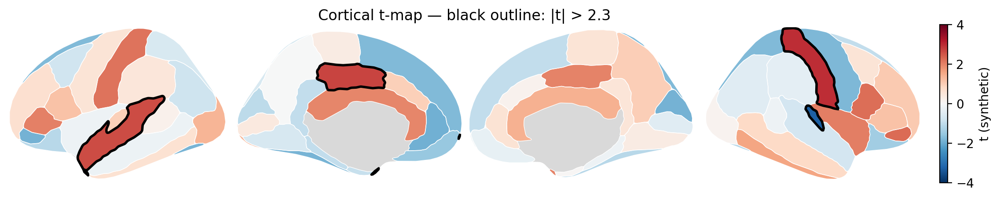

<p align="center">
  
</p>

<h1 align="center">pyseg</h1>

<p align="center">
  <em>ggseg-style brain plots for Python — with significance outlines that stay on top.</em>
</p>

<p align="center">
  
  
  
  
</p>

---

We really like [ggseg](https://github.com/ggseg/ggseg). We also really like
Python. `pyseg` brings ggseg's look and its vocabulary across: the same atlases,
the same `position` / `hemisphere` / `view`, drawn with matplotlib — or as a
[plotnine](https://plotnine.org) layer, if you miss the grammar.

It adds the one thing we kept fixing by hand afterwards. Outlines marking
significant regions are drawn as their own pass, above every fill, so a
neighbouring region can never paint over them and the figure comes out of the
script ready to use.

## Features

- **Significance outlines that stay on top** — the reason this exists.
- **23 atlases** bundled — dk, aseg, glasser, jhu and 19 Schaefer
  parcellations — with no R needed to use them.
- **ggseg's layout**: `position`, `hemisphere`, `view`, in ggseg's own vocabulary.
- **Forgiving region names** — FreeSurfer output plots without renaming a thing.
- **Clean geometry** — stray specks and coarse corners smoothed out on load.
- **Two backends** — matplotlib, or a `plotnine` layer for the full ggplot grammar.
- **Connectomes** — arcs between region centroids, over the same atlas.

## Install

```sh
pip install -e .              # add [ggplot] for the plotnine layer
python test_pyseg.py       # check
```

## Quick start

```python
import pyseg

fig, ax = pyseg.plot_brain(
    {"superiorfrontal_left": 2.1, "insula_right": -1.4},   # dict or pd.Series
    atlas="dk",
    sig=["superiorfrontal_left"],     # or {region: bool}; drawn black, on top
    cmap="RdBu_r", vmin=-3, vmax=3, ylabel="t-value",
)
fig.savefig("fig.pdf")     # returns (fig, ax); never calls plt.show()
```

Colours follow ggseg: white borders between regions (`edgecolor`), grey where
there is no data (`na_color`), black on top for `sig` (`sig_color`, `sig_lw`).

### Layout

```python
pyseg.plot_brain(t, position="stacked")   # views x hemispheres; default "dispersed"
pyseg.plot_brain(t, hemisphere="left")
pyseg.plot_brain(t, view="lateral")
```

### ggplot

`geom_brain` returns a [plotnine](https://plotnine.org) object, so ggplot2's
grammar takes over — scales, themes, labs, and your own facetting:

```python
from plotnine import scale_fill_gradient2, labs
pyseg.geom_brain(t, sig=fdr_hits) + scale_fill_gradient2() + labs(fill="t")
```

### Connectome

```python
pyseg.plot_connectome(corr_df, atlas="dk", hemisphere="left", threshold=0.3)
```

## API

| | |
|---|---|
| `plot_brain(data, atlas, sig, ...)` | the workhorse; returns `(fig, ax)` |
| `plot_dk` / `plot_aseg` / `plot_tracts` | cortex / subcortical / JHU tracts |
| `plot_connectome(edges, atlas, ...)` | arcs between region centroids |
| `geom_brain(data, atlas, sig, ...)` | the same, as a plotnine object |
| `as_brain_df(atlas)` | tidy polygons, ggseg's `as.data.frame()` |
| `brain_atlases()` | what's available, with region counts |
| `brain_regions(atlas)` | canonical region names |
| `brain_labels(atlas)` | the atlas' own labels (FreeSurfer names) |
| `brain_views(atlas)` | `(panel, hemisphere, view)` per panel |

## Region names

Names are matched loosely: `lh_bankssts`, `bankssts_left`, `L-bankssts` and
`Left bankssts` all hit the same region, so FreeSurfer output needs no renaming.
Each atlas also ships ggseg's own labels as aliases, so `Left-Thalamus` finds
`thalamusproper_left` even though FreeSurfer 7 dropped the `-Proper`. Anything
that still doesn't match warns instead of vanishing silently.

## Atlases

**23 atlases, no R required.** They ship with the package as one small gzipped
table each — 23 files, 2 MB in total.

| atlas | regions |
|---|---|
| `dk` | 70 |
| `aseg` | 26 |
| `glasser` | 359 |
| `jhu` | 21 |
| `schaefer7_100` … `schaefer7_900` | 100–884 |
| `schaefer17_100` … `schaefer17_1000` | 100–978 |

```python
pyseg.brain_atlases()      # every atlas with its region count
```

Schaefer's larger parcellations come up short of their nominal count: ggseg's
2-D traces lose the smallest parcels, so `schaefer7_900` draws 884 of 900. The
counts above are what actually draws. `schaefer7_1000` is not shipped at all —
in `ggsegSchaefer` it carries the same 884 labels as `schaefer7_900`.

To add another ggseg atlas, install its R package and run:

```sh
Rscript tools/export_ggseg_atlas.R dkt aal   # from the repo root
```

That writes `pyseg/data/<atlas>.tsv.gz`. R is a maintainer's tool, never a
user's. `atlas=` also takes a path to such a file, or to a directory of one
file per region if you trace your own.

## Geometry cleanup

ggseg's atlases were digitised region by region rather than built as a
partition, so neighbours genuinely overlap — in dk's left lateral panel 43 of
210 region pairs do, fusiform and inferior temporal by 15.6% of the smaller one.
Drawn as separate patches that reads as doubled, uneven borders. The exporter
cuts each region out of what has already been placed, smallest first, so a panel
is a true partition and every border is one line: overlap drops from 2.31% of
the panel's area to 0, and the covered area is unchanged. Set `TOPOLOGY <- FALSE`
in the exporter for ggseg's raw polygons.

The traced atlas geometry carries a few strays: sub-pixel rings, and slivers of
a parcel left in a view it barely reaches. They are invisible when filled, but
each one still takes an outline stroke, so with `sig` they show up as lone
specks and dashes. `pyseg` drops them on load — never the last shape a parcel
has, and never a hole. Outlines also get two rounds of corner cutting, since the
traces are coarse enough to look spiky once you stroke them; the cut is scaled
to each ring, so parcels keep their area to within 2% (`smooth=0` for the raw
geometry).

## Example

[`examples/dk_example.py`](examples/dk_example.py) plots a synthetic t-map on dk
and aseg, outlined regions in black. [`examples/gallery.py`](examples/gallery.py)
sweeps every layout against three outline weights.



## Credits

Atlas geometry from [ggseg](https://github.com/ggseg/ggseg) (MIT) and
[python-ggseg](https://github.com/ggseg/python-ggseg). Repository layout
inspired by [yabplot](https://github.com/teanijarv/yabplot).
