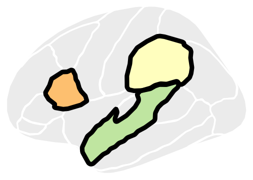

<p align="center">
  
</p>

<h1 align="center">brainseg</h1>

<p align="center">
  <em>ggseg-style brain plots for Python — with significance outlines that stay on top.</em>
</p>

<p align="center">
  
  
  
  
</p>

---

`ggseg` draws each region as a single patch carrying both fill and edge, so a
neighbour drawn later paints over the black outline of a significant region —
and the figure has to be restacked by hand in Illustrator. `brainseg` draws
fills, then all outlines, then significant outlines, as separate passes. Nothing
can occlude anything.

## Features

- **Significance outlines that stay on top** — the reason this exists.
- **Five atlases**, exported from R: dk, aseg, glasser, schaefer7_400, jhu.
- **ggseg's layout**: `position`, `hemisphere`, `view`, in ggseg's own vocabulary.
- **Forgiving region names** — FreeSurfer output plots without renaming a thing.
- **Clean geometry** — ggseg's stray specks and staircase corners handled on load.
- **Two backends** — matplotlib, or a `plotnine` layer for the full ggplot grammar.
- **Connectomes** — arcs between region centroids, over the same atlas.

## Install

```sh
pip install -e .              # add [ggplot] for the plotnine layer
python test_brainseg.py       # check
```

## Quick start

```python
import brainseg

fig, ax = brainseg.plot_brain(
    {"superiorfrontal_left": 2.1, "insula_right": -1.4},   # dict or pd.Series
    atlas="dk",
    sig=["superiorfrontal_left"],     # or {region: bool}; drawn black, on top
    cmap="RdBu_r", vmin=-3, vmax=3, ylabel="t-value",
)
fig.savefig("fig.pdf")     # returns (fig, ax); never calls plt.show()
```

Colours follow ggseg: white borders between regions (`edgecolor`), grey where
there is no data (`na_color`), black on top for `sig` (`sig_color`, `sig_lw`).

### Layout

```python
brainseg.plot_brain(t, position="stacked")   # views x hemispheres; default "dispersed"
brainseg.plot_brain(t, hemisphere="left")
brainseg.plot_brain(t, view="lateral")
```

### ggplot

`geom_brain` returns a [plotnine](https://plotnine.org) object, so ggplot2's
grammar takes over — scales, themes, labs, and your own facetting:

```python
from plotnine import scale_fill_gradient2, labs
brainseg.geom_brain(t, sig=fdr_hits) + scale_fill_gradient2() + labs(fill="t")
```

### Connectome

```python
brainseg.plot_connectome(corr_df, atlas="dk", hemisphere="left", threshold=0.3)
```

## API

| | |
|---|---|
| `plot_brain(data, atlas, sig, ...)` | the workhorse; returns `(fig, ax)` |
| `plot_dk` / `plot_aseg` / `plot_tracts` | cortex / subcortical / JHU tracts |
| `plot_connectome(edges, atlas, ...)` | arcs between region centroids |
| `geom_brain(data, atlas, sig, ...)` | the same, as a plotnine object |
| `as_brain_df(atlas)` | tidy polygons, ggseg's `as.data.frame()` |
| `brain_atlases()` | what's available, with region counts |
| `brain_regions(atlas)` | canonical region names |
| `brain_labels(atlas)` | the atlas' own labels (FreeSurfer names) |
| `brain_views(atlas)` | `(panel, hemisphere, view)` per panel |

## Region names

Names are matched loosely: `lh_bankssts`, `bankssts_left`, `L-bankssts` and
`Left bankssts` all hit the same region, so FreeSurfer output needs no renaming.
Each atlas also ships ggseg's own labels as aliases, so `Left-Thalamus` finds
`thalamusproper_left` even though FreeSurfer 7 dropped the `-Proper`. Anything
that still doesn't match warns instead of vanishing silently.

## Atlases

| atlas | regions | views |
|---|---|---|
| `dk` | 70 | lateral, medial × L/R |
| `aseg` | 26 | coronal, sagittal |
| `glasser` | 359 | lateral, medial × L/R |
| `schaefer7_400` | 400 | lateral, medial × L/R |
| `jhu` | 21 | one |

`glasser` is 359, not 360 — `10pp` exists in one hemisphere only in
`ggsegGlasser`. To add any other ggseg atlas, install its R package and run:

```sh
Rscript tools/export_ggseg_atlas.R schaefer17_200 dkt   # from the repo root
```

It writes one directory per panel holding one file of SVG path data per region,
plus `_panels`, `_wall` silhouettes and an `_aliases` table of ggseg's labels.
`atlas=` also takes a path to such a directory.

## Geometry cleanup

ggseg's traced geometry sheds strays: sub-pixel rings, and slivers of a parcel
left in a view it barely reaches. They are invisible when filled, but each one
still takes an outline stroke, so with `sig` they show up as lone specks and
dashes. `brainseg` drops them on load — never the last shape a parcel has, and
never a hole. Outlines also get two rounds of corner cutting, since ggseg's
traces are coarse enough to look spiky once you stroke them; the cut is scaled
to each ring, so parcels keep their area to within 2% (`smooth=0` for the raw
geometry).

## Example

## Credits

Atlas geometry from [ggseg](https://github.com/ggseg/ggseg) (MIT) and
[python-ggseg](https://github.com/ggseg/python-ggseg). Repository layout
inspired by [yabplot](https://github.com/teanijarv/yabplot).
